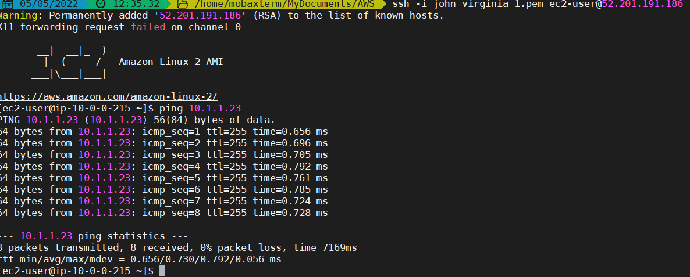

# Exercise1
You did a great job Angel, I really liked it. 
Your code was functional and I managed to create the resources.
I have to mention that the solution of creating an "output" of the whole vpc instance was genious. Did you do that deliberatly or you didn't know that you can create outputs for specific arguments like vpc id etc. This was quite a bit of "advanced" skill to be demonstrated on first exercise :) :)

**Try to correct:** 
1.  Try to be as neutral as possible inside the module definition. if you name the module resources "exercise1" then all the instances created by that will have this "exercise1" inside their naming.
Of course later on, you will copy and paste the modules (I asked you to write them from scratch for the first 4 exercises) and you don't want to see this "exercise1" in every single project.
2.  Also try to create an optional map variable for the tags. Do not hardcode tags inside the modules.
3.  Try to understand which arguments are neccessary for the module definition.

# Exercise2
Good job Angel. You split the stages and you understood the point of this exercise. Keep up the good work!

# Exercise3
Good Job. I deployed your infrastructure with no issue.

## Comments
When you define the Route table you have 2 options:
1.  Define routes **inline** inside the route table definition (this is not preferable)
2.  Define another resource "route" and associate it with the route table (this is the correct way)

You can not have both. It creates a conflict. pls read the first NOTE of the route table definition link:
https://registry.terraform.io/providers/hashicorp/aws/latest/docs/resources/route_table

So please delete the 4th line of route table definition where it says: "route = []"

# Exercise4
Good job. Ping was successful, getting replies.

## Comments
You did not have to define 2 boolean vars to launch public ip. For the private subnet you could just ignore it.

Read the comments for this exercise on the outer README md file. I want you to understand how we can declare an optional variable.
### Optional variables
Optional Variables have as **default** value **null**.
Later on we will be using the "transit gateway id " instead of "gateway_id". How can you solve this problem? Are you going to modify the route module everytime? the answer is no. you can define all the possible destinations as optional.

# Exercise5
Good job. I liked tha fact the you split the terraform files to "vpc-subnet-rt" and "igw-instance" related resources.

# Exercise-6
You did Great! 27 resources have been created and I managed to ping the second ec2 instance.


# Exercise-7
I receive a plan of 28 resources to be created, great. I managed to ssh and ping the second EC2. Well done!
```bash

[ec2-user@ip-10-0-0-75 ~]$ ping -c4 10.1.1.123
PING 10.1.1.123 (10.1.1.123) 56(84) bytes of data.
64 bytes from 10.1.1.123: icmp_seq=1 ttl=254 time=2.13 ms
64 bytes from 10.1.1.123: icmp_seq=2 ttl=254 time=1.18 ms
64 bytes from 10.1.1.123: icmp_seq=3 ttl=254 time=1.27 ms
64 bytes from 10.1.1.123: icmp_seq=4 ttl=254 time=1.16 ms

--- 10.1.1.123 ping statistics ---
4 packets transmitted, 4 received, 0% packet loss, time 3004ms
rtt min/avg/max/mdev = 1.164/1.442/2.139/0.404 ms
[ec2-user@ip-10-0-0-75 ~]$
```

## Comments
1.  You gave both of your VPCs the same Name as tag. This doesn't help you when you check the console. Try "VPC1" and "VPC2" instead ;).
2. Why did you name two of the subnets as "Public". Only the VPC1 has a public subnet because it has a route to the IGW. Remember that this is the only criteria to be characterized a subnet as "public".
3. I would like you to be more helpful when it comes to subnet naming. Try "vpc1_subnet1", "vpc1_subnet2", "vpc2_subnet1" and "vpc2_subnet2" OR even concatenate the type of subnet at the end of the naming instead of giving all subnets the same name.
4. This is not so important: You do not need SG to allow ping to the bastion (jumphost). Only SG to allow ping to the ec2 with the private only IP. Think about it! It is not a problem however.


# Exercise 9, 10 , 11 (12 ?)
You did a great job so far! You did the extra mile of creating a good structure with modules, stage subfulders etc. My solution was simpler but what you did is the right thing.

## Comments 
* Please try **always to place count on the first line** if it is a resource ( and after source if it is module).
* After count place a blank line. So, the eye can catch the **count** easily.