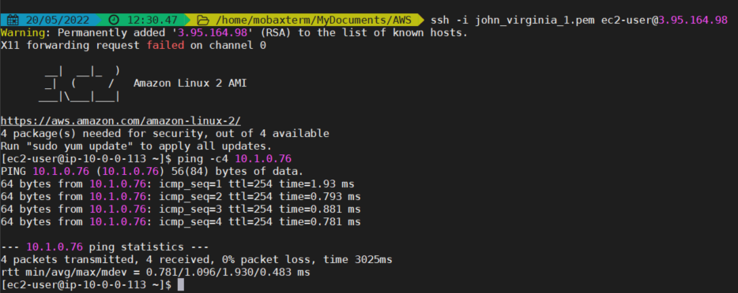

# terraform-training
Welcome! Here I will put the definition of each exercise and the general comments for everyone. Individual comments will be inside student folder.
Please work only inside your personal folder. I will put here (at root level) the solution of each exercise peeking randomly one of yours. 
That way we do not have to create branches. After each exercise **always DESTROY** the infrastructure. Make sure you also run a "terraform destroy -var-file=dev.tfvars" before you delete the state file. Otherwise you will have to delete **manually** the resources. (it is not so difficult ;) ).
Clean your folder after exercise and start solving the next one. 

# Author Ioannis Koustoudis
Author Ioannis Koustoudis, ikoustou@gmail.com

## Exercise-1
### Definition
Create the following resources using terraform:
*   One VPC (you can choose the VPC CIDR) with
*   Two Subnets
*   One Route table 
*   Associate the Route table with the subnets
Try to use modules where it is possible. Each module subfolder will have 3 files: main.tf , vars.tf and outputs.tf
Your route directory will include a main.tf and vars.tf as well.

### Comments
You did it very well. You learnt how to:
1.  Organize your code in **Modules**
2.  Call "modules" in your main.tf
3.  Create the "alias" names of outputs each module can export inside the **outputs.tf** of each module.
4.  Call and use these aliases of **different** module output.

You could also use the first available /24 CIDR for your first subnet which is: 10.0.0.0.0/24
And the second subnet would take the next available: 10.0.1.0/24

## Exercise-2
### Definition
Repeat the previous exercise. This time pay attention to use modules for everything and do not combine modules with resources inside the main.tf:
*   Create to subfolders with the names: stage1 and stage2
*   Remove eny terraform.state and any .terraform folder from the root level
*   Go inside each stage and run terraform init to deploy the same resources in us-east-1 and us-east-2 respectively
*   Define a variable with name "region"
*   Remove any default value from all variables
*   Use a dev.tfvars file to give values for all variables
When you will define the main.tf in each stage you will set as source "../"
Good luck

### Comments
I guess what you did works and could be considered as good result. However, that was not what I had in my mind. No worries the definition might have been be a bit confusing. Also it might be the case that on my Terraform tutorial in demo04 and demo06 where I want to focus on "stages" the implementation is like yours here, but on demo07,08,10,11 the implementation is like the one I had in my mind. Which means:
*   You have all **the code that is shared** between stages outside of stages, **at the root level**. Then inside the stage/example you create a main with reference to the root level. If there is one level aboup, the **source** will be "../", if there are two levels up the **source** will be "../../". Did you pay attention on my last sentence of definition (just before the "Good luck")? ;) :)

I will create another folder with title "TRN-2-FINAL" with the desired result.

### regarding the variable naming
By the way, you might think that there is **still** repeating code when you refer to vars.tf file of root level and vars.tf of the stage level. Well, yes it seems so. But actually that is not true.
Let me explain:
*   The vars.tf of the **root level** define the variables you named inside the **maint.tf of the root level**. 
*   This is how var naming works: inside the main.tf of the root level, when you refer to a variable name, this name is the variable name you defined inside the **module level** on the right hand side of each equation. **Only the left hand side of each equation (inside the module) holds the name of the variable that Hashicorp wants to see defined**. On the right hand side of the equation on module level is a naming that suits us best. We might give the name as the left hand side but we might name this variable **foo**.
To sum up the variable name on the left hand side of the equation inside a **module instance** is the **foo** of the right hand side of the equation of the module level.
*   The variable name of the right hand side of each equation inside the module instances of the main.tf of the root level could be identical but could also be different like **bar**. The vars.tf of the root level holds the definition of these **bar** variables.
*   Inside the stage level: the variable name of the left hand side of each equation is the **bar** of the root level definition. the variable name of the right hand side of each equation inside the stage level could be identical but could also be different like **baz**.

To sum up: Variable **definition** :
1.  inside the module level **foo**
2.  inside the root level **bar**
3.  inside the stage level **baz**

The naming could be different but could also be the same. Most of the time we follow Hashicorp naming, that is why it seems like we have code that it is repeated but this is not the case.

### Provider file
My provider.tf file has the following structure and it exists at the root level
```terraform
provider "aws" {
  access_key = "####"
  secret_key = "########"
  region  = var.region
}
```
### Always Destroy
**Do not forget to destroy the resources by the end of your exercie, otherwise you might be charged**
You are not charged for VPCs and subnets but later on with EC2 instances you will be charged. 

## Exercise-3
### Definition
Create the following resources using terraform:
*   One VPC (you can choose the VPC CIDR) with
*   Two Subnets (name one public and the other private).
*   Two Route tables with appropriate naming (rt-public, rt-private).
*   Associate the private Route table with the private subnet and the public route table with the public subnet.
*   One Internet Gateway -IGW attached to your VPC.
*   A default (0.0.0.0/0) route inside the public route table to send all traffic to IGW. (This route to IGW makes the route table to be **public**)
Try to use modules where it is possible. Each module subfolder will have 3 files: main.tf , vars.tf and outputs.tf
Your route directory will include a main.tf and vars.tf as well.


### Comments
1. Try not to use tf-11 version way of writing code. I am talking about the "tags" inside the modules, you could use: Name = var.igw_name
2. Try inside the modules to be as neutral as you can. Do not give logical names of the resources that reminds you the project because it is very likely to copy the whole folder of the module to another project and then there will be chaos. Take a look inside all of the modules apart the "route", you gave the name "TRN-3".
3. In **route** module the variable "gateway_id" is not Optional as you claim in the description. Try to make it trully **Optional**. Use default = null
4. Try to define **other** optional variables (not only gateway_id) as well inside the **route** module so it will suit for all different scenarios: 
    1.  nat_gateway_id - (Optional) Identifier of a VPC NAT gateway.
    2.  local_gateway_id - (Optional) Identifier of a Outpost local gateway.
    3.  network_interface_id - (Optional) Identifier of an EC2 network interface.
    4.  transit_gateway_id - (Optional) Identifier of an EC2 Transit Gateway.
    5.  vpc_endpoint_id - (Optional) Identifier of a VPC Endpoint.
    6.  vpc_peering_connection_id - (Optional) Identifier of a VPC peering connection.

## Exercise-4
### Definition
Create the following resources using terraform:
*   One VPC (you can choose the VPC CIDR) with
*   Two Subnets (name one public and the other private).
*   Two Route tables with appropriate naming (rt-public, rt-private).
*   Associate the private Route table with the private subnet and the public route table with the public subnet.
*   One Internet Gateway -IGW attached to your VPC.
*   A default (0.0.0.0/0) route inside the public route table to send all traffic to IGW. (This route to IGW makes the route table to be **public**).
*   Security group which will allow inbound traffic ping (ICMP) from all CIDRs (0.0.0.0/0). (module instance).
*   An EC2 instance which will be placed inside the public subnet and it will have the above security group attached and an **existing** key-pair in that region
The only resource that you will create by the console and download it on your local machine is the key pair. This key pair will be useful for other exercises, so do not delete it.
Try to use modules where it is possible and try to keep the resource naming neutral inside the modules.

### Tips
Try to keep the code separated. So, I want you to reorganize it like this:
1.  A main.tf containing only the "terraform" block
2.  A "vpc_subnets_rt.tf" with the code of vpc, subnet, route tables and rt-subnet-associations
3.  A "igw_instance.tf" with the igw, segurity group and ec2 instance code.
The variables can stay in one file "vars.tf".
This way you can copy one of the above files in another project, without wasting time to go inside "main.tf" and copy the exact resources.

### Testing
Test your infrastrusture by pinging the public ip of the EC2 instance. If it doesn't take public ip try to solve it. I mentioned the solution during our previous meeting but I didn't see any modification of the **subnet** module. ;)


## Exercise-5
### Definition
Use the code of the previous exercise to create the same infrastructure. This time add the following additional resources:
* modify the module for the EC2 instance creation in such way that you do not have to provide the correct ami id of the region. A **data source** will filter the amis for amazon "owner" and "hvm" architecture.
* Launch a second EC2 instance inside the private subnet.
* Create a similar with the first Security group which allows ping (icmp). Assign it to the second EC2 instance so it can reply to ping requests from the first ec2 instance.
* Create a third security group which will allow ssh (port 22) from anywhere and assign it to the first ec2 instance of the public subnet. This way we can connect via ssh to it and then pinging the second ec2 instance.

### Tips
Use the following data source to filter and identify the correct ami in every region. This piece of code will be placed inside the ec2 instance module definition:

```terraform
data "aws_ami" "amazon" {
  owners      = ["amazon"]
  most_recent = true

  filter {
    name   = "owner-alias"
    values = ["amazon"]  
  }

  filter {
    name   = "name"
    values = ["amzn2-ami-hvm*"]
  }
}
```


## Exercise-6
Create 2 VPCs, each one with two subnets, route-tables. For the first VPC1 associate an internet gateway and a default route from the public route table. Launch two EC2 instances on each VPC. On the First VPC launch it on the public subnet and allow ssh and ping with Security Groups. On the second VPC it doesn't matter, allow ping with SG.
Create a VPC peering between the two VPCs. Add the correct routes to send traffic to the other VPC CIDR and as destination the VPC peering endpoint.
Test the infrastructure by ssh on the first instance of VPC1 and pinging the second instance on VPC2.
It is similar to Exercise-5. Here, we use 2 VPCs instead of one.


## Exercise-7
Same exercise like Ex-6 the difference will be transit gateway attachments instead of VPC-peering
Create 2 VPCs, each one with two subnets, route-tables. For the first VPC1 associate an internet gateway (IGW) and a default route to point to the IGW from the public route table. 
Create a Transit Gateway. Choose your ASN number (range from 64512 to 65534).
Create Transit Gateway VPC attachments You can define "depends_on" sections to be sure that the VPC will be created before the TGW-VPC-attachment.

Create routes inside the VPC route tables to send traffic with destination the other VPC_CIDR block to the TGW.

Launch two EC2 instances on each VPC. On the First VPC launch it on the public subnet and allow ssh with Security Groups. On the second VPC it doesn't matter in which of the two subnets you will launch it but you have to allow Ping (icmp). 

Test the infrastructure by ssh on the first instance of VPC1 and pinging the second instance on VPC2.
It is similar to Exercise-6. Here, we use 2 VPCs peered via TGW instead of VPC peering.


## Exercise-8
Same exercise like Ex-7 the difference will be creation of two transit gateway route tables (apart from the one that is created with the TGW) associated with each of the TGW-VPC-attachments (instead of having only one TGW-Route-Table with "Default Association" enabled
Create 2 VPCs, each one with two subnets, route-tables. For the first VPC1 associate an internet gateway (IGW) and a default route to point to the IGW from the public route table. 
Create a Transit Gateway. Choose your ASN number (range from 64512 to 65534). 

**Disable "default_route_table_association", AND "default_route_table_propagation". These two arguments are of string type and they take values "enable" or "disable"**. You can define them as optional inside the TGW module. I hope you know how to define an optional variable by now. Here is a piece of code:
```terraform
# tgw main.tf
resource "aws_ec2_transit_gateway" "tgw" {
  amazon_side_asn                 = var.amazon_side_asn

  default_route_table_association = var.default_route_table_association
  default_route_table_propagation = var.default_route_table_propagation 
}
# tgw vars.tf
variable "amazon_side_asn" {
  description = "Amazon side ASN"
  type        = string
}
variable "default_route_table_association" {
  type    = string
  default = "enable" 
}
variable "default_route_table_propagation" {
  type    = string
  default = "enable" 
}
```
And when you will deploy the TGW instance:
```terraform
# tgw
module "tgw" {
  source = "./modules/tgw"

  amazon_side_asn = var.amazon_side_asn
  default_route_table_association = "disable"
  default_route_table_propagation = "disable"
}
```
Create Transit Gateway VPC attachments You can define "depends_on" sections to be sure that the VPC will be created before the TGW-VPC-attachment.
**SUPER IMPORTANT**: Do exactly the same as above example with the two **boolean** variables of the "aws_ec2_transit_gateway_vpc_attachment" resource:
* transit_gateway_default_route_table_association  and
* transit_gateway_default_route_table_propagation
Check solution. 
Why is this so important? because the tgw-vpc-attachment resource has these two bool variables as "true" by default and it will search for the **default** TGW-Route-Table to attach them which **does not exist** and the code will be failing.


Create 2 TGW-route-tables, each one will be dedicated to a specific VPC attachment.
Create 2 TGW-route-table-associations with the TGW-VPC-Attachments
Create static routes inside each of TGW-Route-Tables to cend traffic routed to the **other** VPC-CIDR with the right TGW-VPC-Attachment as the next hop (destination).

Create routes inside the TGW-Route-Tables to send traffic with destination the other VPC_CIDR block to the TGW. **to make your life easier: create them via propagation defining a module for the resource "aws_ec2_transit_gateway_route_table_propagation" instead of creating static tgw-route via "aws_ec2_transit_gateway_route"**.


Launch two EC2 instances on each VPC. On the First VPC launch it on the public subnet and allow ssh with Security Groups. On the second VPC it doesn't matter in which of the two subnets you will launch it but you have to allow Ping (icmp). 

Test the infrastructure by ssh on the first instance of VPC1 and pinging the second instance on VPC2.
It is similar to Exercise-7. Here, we use dedicated TGW-Route-Tables instead of having only one (the default-route-table-association).

**Good to remember**: each TGW-VPC-Attachment is associated with only **ONE** TGW-Route-Table.

### Test your infrastructure by ssh to bastion in VPC1 and ping to the ec2 in VPC2
 


## Exercise-9
Create an EC2 instance resource four (4) times using **count**. Use the default VPC in a region. So, there is no need to create VPC.
Also no need to ssh, so you don't have to define key-pair. You can still use the data aws_ami with the following filters to query the ami id for "amazon linux" for this region, OR you can just hardcode and provide this value (the ami id for the region you are working)
```terraform
data "aws_ami" "amazon" {
  owners      = ["amazon"]
  most_recent = true

  filter {
    name   = "owner-alias"
    values = ["amazon"]  
  }

  filter {
    name   = "name"
    values = ["amzn2-ami-hvm*"]
  }
}
```

## Exercise-10
Create an EC2 instance only if a boolean variable is **true**.

### Tip: Use "count" in combination with "conditional expression"
Conditional expression:
condition ? value_when_true : value_when_false


## Exercise-11
Create so many VPCs as the length of a variable of type list. Let's say create 2 VPCs, initially. Then add one more CIDR to see how the terraform plan will show one more VPC.

### Tip: use the legth() function which gives you the legth of a list variable

## Exercise-12
Create a variable of type "map(object)" in such way that the keys of each object will be "vpc1", "vpc2" and inside each object you will give two key-value pairs, with keys:
* name
* cidr
Create so many vpcs using the **for_each** terraform function. After the first creation, play commenting out VPC objects and see how the VPCs will be destroyed.

### Tip: use each.value.name and each.value.cidr to retrieve the value of second level keys: name and cidr respectively.
You can use each.key and each.value to retrieve either the key or the value of each loop.

### Tip2: only in case you feel you can not create the variable have a look here:
```terraform
# vars.tf file
variable "vpcs_data" {
    description = "vpcs objects"
}

# dev-vars.tfvars file
vpcs_data = {
    vpc1 = {
        name = "VPC1"
        cidr = "10.0.0.0/16"
    }
    vpc2 = {
        name = "VPC2"
        cidr = "10.1.0.0/16"
    }
}
```

### Exercise-13
Tips about loops:
* When you use count on a resource that resource becomes member of a list os resources. 
Pay attention on loops based on index. Changing the order in an array where the loop is based on will cause terraform to re-create (destroy the old and create the new) resources. Experiment with an exercise like Exercise-11 and after applying the plan try to re-arrange the order of the list and re-run the plan again.
* When you use for_each on a resource, it becomes a map of resources. (maps do not have order). This is very important as it allowes us to remove items from the middle of the map without affecting the rest of the resources.
* Terraform requires the **count** and **for_each** are countable during the plan phase, **before** any resources are created. Count and for_each can not be results of any calculation.
* Module support for count was added in Terraform 0.13, and previous versions can only use it with resources.

### Exercise-14
As per Chris' suggestion: create a vpc with cidr 10.0.0.0/16 in us-east-1 with 2 subnets: 10.0.0.0/24 and 10.0.1.0/24 and two (2) route tables associated with one subnet each.
Use a boolean variable named like "public_subnet1_bool" to control the creation of an IGW and a default route to the IGW inside the first subnet's route table.
Play with the boolean variable to either create or destroy these two resources (IGW and the default route-to-IGW) based on its value.

### Exercise-15 
Import existing infrastructure into terraform state file.
Deploy something simple using the console and try to import it inside the terraform state. You will need to use the **import** command of each resource that you import and of course to have written the terraform code for the imported resource.


# Useful tips
*   module **source** argument starts either with "./" or "../" to indicate that a local path is intended, to distinguish from a module registry address.


